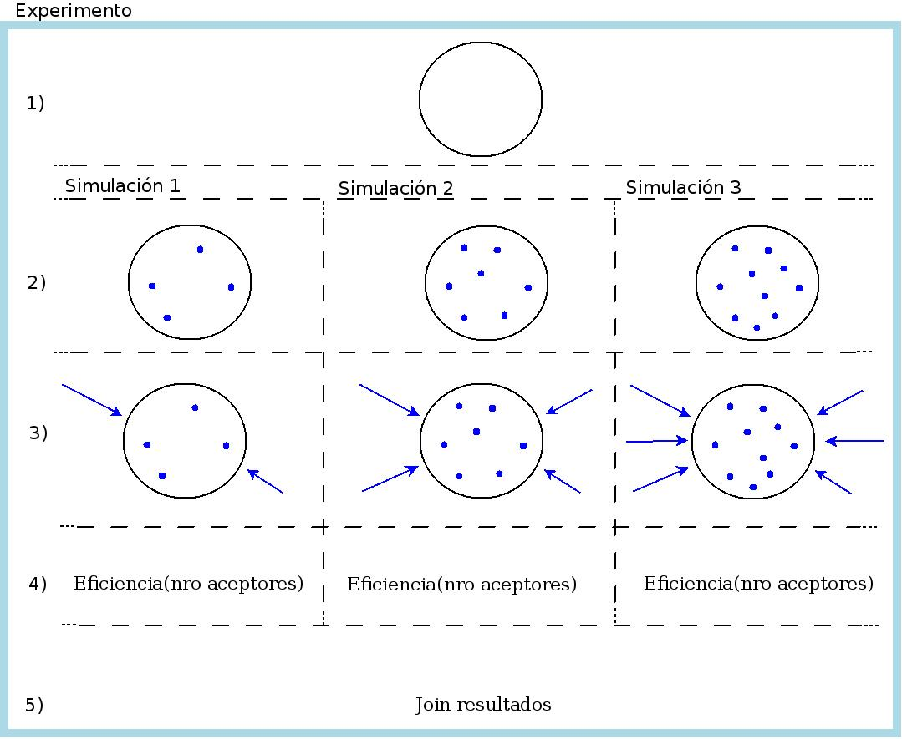

# TEN
**Transferencia de Energía en NanoParticulas**

##Equipo de trabajo.

*Directores:*  
* Chemical: **Dr. Rodrigo Palacio**  
* Cloud computing: [**Dr. Jose Luis Vazquez-Poletti**](http://www.dsa-research.org/doku.php?id=people:poletti)

*Students*:  
* PhD student **Rodrigo Ponsio**  
* Master student **Daniel Bellomo**  
* Undergraduate **Franco Bellomo** @fnbellomo  
* Undergraduate **Lucas Bellomo** @ucaomo

##Objetivo.

Comprobar eficiencia de Quenching.

Mediante simulaciones de Monte Carlo, se quiere estudiar la eficiencia de Quenching para una nanopartícula (NP) determinada. Estas simulaciones van a ser contrastadas con las mediciones experimentales realizadas en el Laboratorio de Microscopia Optica Avanzada (LMOA) de la Universidad Nacional de Río Cuarto (UNRC).

En principio, son tres los experimentos en los que queremos corroborar la eficiencia de Quenching:  
1. En el caso de tener los aceptores distribuidos volumetricamente en la NP.  
2. Que los aceptores estén sobre la superficie de la NP.  
3. En los dos casos anteriores el fotón es generado mediante un laser. Se quiere estudiar que sucede en el caso de que sea generado mediante una electrólisis química.

Para el experimento 1, estamos trabajando basados un en paper, desarrollando nuestra herramienta computacional. Para los experimentos 2 y 3, se quiere verificar una hipótesis de trabajo, no existiendo trabajos de referencia.

##Resumen de funcionamiento.

Basicamente, el código (escrito en python3) funciona de la siguiente forma:
* **Creamos un objeto NP** con sus propiedades como el radio, cantidad de aceptores, etc. Dichas propiedades se especifican en el archivo config.py.
* **Generamos los aceptores** distribuidos uniformemente sobre la NP. Estos aceptores pueden estar distribuidos sobre la superficie o dentro de la NP.
* **Creamos el obtejo Photon** generandolo aleatoriamente sobre la NP.
* **Movemos el fotón** y calculamos la probabilidad de que decaiga, se transfiera a un aceptors o realize un random walk donde se realiza este ultima paso nuevamente.

Por la manera en la que esta modulizado el código, podemos bombardear a la misma NP con los mismo aceptores, la cantidad de veces que deseemos.

##Experimento.

En la fig se muestran los procesos que intervienen en el experimento, con el objeto de detallar los procesos secuenciales y paralelos (multicore/GPU/cluster/cloud). Existen tres niveles de paralelismo:

a. bombardeo de fotones, el punto 3) de la fig.
	- paralelizar en multicore/GPU/cluster.
b. cada una de las simulaciones (identificada por cada columna en la fig).
	- paralelizar en cluster/cloud.
c. cada experimento (identificado por la fig. completa).
	- paralelizar en la infraestructura cloud.

1. Los parámetros que definen un determinado experimento están dados en el archivo de configuración 'conf.py'.
   - Definir la nanoparticula (NP). Es la misma NP en todo el experimento ('conf.py).
   - Definir cantidad de simulaciones para la NP dada. En el ej. de la fig, son tre simulaciones (las columnas).
2. Dopar la NP: generar aceptores, distribuirlos homogeneamente, etc. (serial).
   - La cantidad de dopamientos es distinta de cada simulación.
3. Bombardear la NP: la cantidad de bombardeos es distinta en cada simulación.
   - El bombardeo se debe hacer en paralelo (multicore/GPU/Cluster). Cada bombardeo (indicado por cada flecha en la Fig) tiene un ID único y obtiene un único resultado. Todos los bombardeos de una simulación escriben su resultado en una variable (array) compartida accediendo mediante su ID al subindice correspondiente.
4. Se calcula la eficiencia en función del nro de aceptores (cálculo serial).
5. Join de los resultados de cada una de las simulaciones para su post-procesamiento (gráfico).

Se podran ejecutar un nro arbitrario de experimentos distintos en simultáneo haciendo uso de la infraestructura cloud.

##Primeros Output
El código de esta salida esta en el notebook `ten/examples/test.ipynb`

    TEN 2015-05-09 00:37:18.493444

    Linux-3.16.0-4-amd64-x86_64-with-debian-stretch-sid
    uname_result(system='Linux', node='antu', release='3.16.0-4-amd64', version='#1 SMP Debian 3.16.7-ckt9-3 (2015-04-23)', machine='x86_64', processor='')

	Input parameters:
	-----------------
	NP radius: 50.000
	Forster radius: 2.290
	Length of excition diffusion: 8.000
	Tau_D: 344.000
	Number of acceptors: 60
	Delta_t: 1.000
	Epsilon: 0.023
	Probability of decay: 0.003
	Number of exitations: 500

	Outputs:
	--------
	Amount of decays: 117
	Amount of transfers: 383
	Quenching efficiency: 0.766000

	Total time in seg: 43.010

##Plan de trabajo.
1. Entender el modelo teórico.
2. Realizar prototipo de la aplicación verificando la teória (dominio de la aplicación mínimo).
3. Optimizar performance del código.
4. Ampliar el dominio de estudio (números de NP y de los aceptores).
5. Portar a Cloud Computing.
6. Paralelizar el bombardeo de fotónes usando MPI.

##TODO.
- [x] hacer gráfico detallando procesos seriales y paralelos (detallando paralelismo en el cluster/multicore y procesos al cloud)
- [ ] Usar [Sphinx](http://sphinx-doc.org/) para subir la documentación.
- [ ] Medir la performance del código serial.
- [ ] Gráficos de las eficiencias de cantidad de aceptores vs Quenching.
- [ ] Para una NP, queremos paralelizar el bombardeo de fotónes.
- [ ] Generar el photon mediante una electrolisis química.
- [ ] El archivo de salida, hay que ponerle un nombre representativo. Por ej, dd-mm-aa-id que el id puede ser algo que ingrese el usuario o un random.
- [ ] Herramientas de post-procesamiento:
   - [ ] Leer un output especifico y que grafique los aceptores.
   - [ ] De un directorio, lea todos los output y grafique la eficiencia de quenching
- [ ] Usando MPI, paralelizar la cantidad de bombardeos dentro de un PC.
- [ ] Hacer un interfaz simple de usar, que se le puedan pasar algunos parámetros por cli, o que levante un archivo de configuración y lo chequee.
- [ ] Cuando este funcionando la implementación de MPI, que en el output indique cuantos cpu usa, y el porcentaje (igual que LAMPS).
- [ ] Portar la aplicación a un entrono de Cloud Computing, con el objetivo de realizar simulaciones masivas.
- [ ] Que los aceptores tengan un volumen.

##Licencia.
 TEN is licensed under a <a rel="license" href="http://creativecommons.org/licenses/by/4.0/">Creative Commons Attribution 4.0 International License</a>.  
Todo el código esta bajo licencia [MIT](https://github.com/pewen/ten/blob/master/LICENSE).
