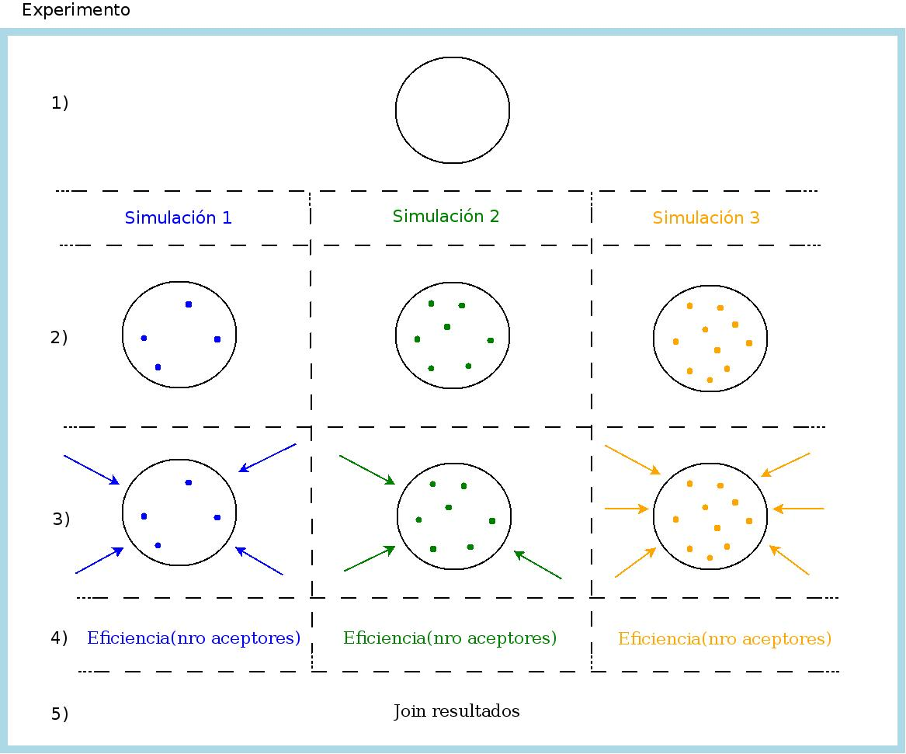

# TEN
**Transferencia de Energía en NanoParticulas**

##Equipo de trabajo

* Químico **Dr. Rodrigo Palacio**  
* Químico **Dr. Carlos Chesta**  
* Metodología de la investigación **Dra. Dolores Rexachs**  
* GPUs Computing **Manuel Ujaldon**
* Estudiante de Doctorado **Rodrigo Ponsio**  
* Estudiante de Maestría **Daniel Bellomo**  
* Estudiante de Grado (desarrolladores del código) [**Franco Bellomo**](https://github.com/fnbellomo) [@fnbellomo](https://twitter.com/fnbellomo)  
* Estudiante de Grado (desarrolladores del código )[**Lucas Bellomo**](https://github.com/lbellomo) [@ucaomo](https://twitter.com/ucaomo)

##Objetivo

Calcular la eficiencia de Quenching.

Mediante simulaciones de Monte Carlo, se quiere estudiar la eficiencia de Quenching para una nanopartícula (NP) determinada. Estas simulaciones van a ser contrastadas con las mediciones experimentales realizadas en el Laboratorio de Microscopia Optica Avanzada (LMOA) de la Universidad Nacional de Río Cuarto (UNRC).

En principio, son tres los experimentos en los que queremos corroborar la eficiencia de Quenching:
1. En el caso de tener los aceptores distribuidos volumetricamente en la NP.
2. Que los aceptores estén sobre la superficie de la NP.
3. En los dos casos anteriores el fotón es generado mediante un laser. Se quiere estudiar que sucede en el caso de que sea generado mediante una electrólisis química.

Para el experimento 1, estamos trabajando basados en este [paper](http://pubs.acs.org/doi/abs/10.1021/jp074149%2B) desarrollando nuestra herramienta computacional. Para los experimentos 2 y 3 se quiere verificar una hipótesis de trabajo, no existiendo trabajos de referencia.

##Documentación

ReadTheDocs: https://ten.readthedocs.org

##Instalación
###Requerimientos

*Core*:
* Python (2.x o 3.x)
* Numpy
* Scipy (Solo es para importar pi. Si no esta instalado, se usa un valor con menor precisión).
* MPI4py
* OpenMPI o MPICH

*Herramientas de post-procesamiento:*
* Matplotlib

###Instalación
TODO setup.py

##Funcionalidades

* Podemos generar aceptores:
    1. En toda la NP con el método: **Nanoparticle.deposit_volumetrically_acceptors()**
    2. En la superficie: **Nanoparticle.deposit_superficial_acceptors()**

* Podemos generar exitones:
    1. En cualquier lugar de la NP, simulando que a esta se la bombardeamos con un laser **Exiton.laser_generated()**
    2. Entre dos radios, simulando que este es generado mediante una electrolisis química **Exiton.electro_generate()**

En todos los casos, las generaciones son con distribución uniforme.

##Resumen de funcionamiento.

Basicamente, el código (escrito en python3) funciona de la siguiente forma:
* **Creamos un objeto NP** con sus propiedades como el radio, cantidad de aceptores, etc. Dichas propiedades se especifican en el archivo `experimento.conf`.
* **Generamos los aceptores** distribuidos uniformemente sobre la NP, usando alguno de los dos métodos explicados anteriormente.
* **Creamos el exiton** generandolo aleatoriamente sobre la NP, usando alguno de los dos métodos explicados anteriormente.
* **Movemos el exiton** calculando las probabilidades de decae, transferencia o de realizar un random walk. En caso de que el exiton se mueva, se realiza este ultima paso nuevamente.

Por la manera en la que esta modulizado el código, podemos bombardear a la misma NP con los mismo aceptores, la cantidad de veces que deseemos.

##Experimento.

En la *Fig. 1* se muestran los procesos que intervienen en el experimento, con el objeto de detallar los procesos secuenciales y paralelos (multicore/cluster/GPU).

###Existen dos niveles de paralelismo:

1. Bombardeo de fotones, el punto *3)* de la fig.  
   - Paralelizar en multicore/cluster/GPU.  
2. Cada una de las simulaciones (identificada por cada columna en la fig).  
   - Paralelizar en cluster.  
3. Cada experimento (identificado por la fig. completa).  
   - Paralelizar en cluster.

######Fig. 1

1. Los parámetros que definen un determinado experimento están dados en el archivo de configuración `experimento.conf`.
   - Definir la NP. Es la misma NP en todo el experimento (`experimento.conf`).
   - Definir cantidad de simulaciones para la NP dada. En el ej. de la fig, son tres simulaciones (las columnas).
2. Dopar la NP: generar aceptores, distribuirlos homogeneamente, etc. (serial).
   - La cantidad de dopamientos es distinta de cada simulación (es definida en el archivo de configuración).
   - Simulación 1: 4 dopamientos
   - Simulación 2: 7 dopamientos
   - Simulación 3: 10 dopamientos
3. Bombardear la NP: la cantidad de bombardeos es distinta en cada simulación (es definida en el archivo de configuración).
   - Simulación 1: 4 bombardeos
   - Simulación 2: 3 bombardeos
   - Simulación 3: 6 bombardeos
   - El bombardeo se debe hacer en paralelo (multicore/GPU/Cluster). Cada bombardeo (indicado por cada flecha en la Fig) tiene un ID único y obtiene un único resultado. Todos los bombardeos de una simulación escriben su resultado en una variable (array) compartida accediendo mediante su ID al subindice correspondiente.
   - Simulación1.Bombardeos[resultado-bombardeo1, resultado-bombardeo2, ...]
   - Simulación2.Bombardeos[resultado-bombardeo1, resultado-bombardeo2, ...]
   - Simulación3.Bombardeos[resultado-bombardeo1, resultado-bombardeo2, ...]
4. Se calcula la eficiencia en función del nro de aceptores (cálculo serial).
   - Eficiencia1 = CalcularEficiencia(Simulación1.Bombardeos)
   - Eficiencia2 = CalcularEficiencia(Simulación2.Bombardeos)
   - Eficiencia3 = CalcularEficiencia(Simulación3.Bombardeos)
5. Join de los resultados de cada una de las simulaciones para su post-procesamiento (gráfico).
   - CalcularEficienciaTotalExperimento(Eficiencia1, Eficiencia2, Eficiencia3)

##Primeros Output

	TEN 2015-10-11 08:20:37.201883

	Linux-4.2.0-1-amd64-x86_64-with-debian-stretch-sid
	uname_result(system='Linux', node='antu', release='4.2.0-1-amd64', version='#1 SMP Debian 4.2.1-2 (2015-09-27)', machine='x86_64', processor='')

	Input parameters:
	-----------------
	NP radius: 15.000 nm
	Foster radius: 3.140 nm
	Mean free path: 100.000 nm
	Tau_D: 0.333 ns
	Number of acceptors: [0, 10, 20, 30, 40, 50, 60, 70, 80, 90, 100, 110, 120, 130, 140, 150, 160, 170, 180, 190, 200, 210, 220, 230, 240, 250, 260, 270, 280, 290, 300, 310, 320, 330, 340, 350, 360, 370, 380, 390, 400]
	Epsilon: 1.000 nm
	Number of exitations: 2500
	Delta_t: 0.003 ns

	Output parameters:
	------------------
	Probability of decay: 0.009950

	+--------------+------------------+---------------------+----------------------+------------+-------------------+------------------+
	| Nº acceptors | Amount of decays | Amount of transfers | Quenching efficiency | Walk mean* | LD calculate [nm] | Total time [seg] |
	+--------------+------------------+---------------------+----------------------+------------+-------------------+------------------+
	|      0       |      5000.0      |         0.0         |         0.0          |  99.8478   |   3.36891335733   |  21.3431690931   |
	|      10      |      3906.0      |        1094.0       |        0.2188        |  74.4108   |   2.95636121512   |  17.1472395658   |
	|      20      |      3106.0      |        1894.0       |        0.3788        |  62.0602   |   2.76635106763   |  14.4962773323   |
	|      30      |      2573.0      |        2427.0       |        0.4854        |  50.9242   |   2.52960251906   |  13.6191756725   |
	|      40      |      2185.0      |        2815.0       |        0.563         |  43.4318   |   2.35737386055   |  17.5249940157   |
	|      50      |      1889.0      |        3111.0       |        0.6222        |  36.5838   |   2.18085205102   |  11.0072609186   |
	|      60      |      1603.0      |        3397.0       |        0.6794        |  32.7408   |   2.09543361844   |  8.76650285721   |
	|      70      |      1442.0      |        3558.0       |        0.7116        |  27.1868   |   1.93225733325   |  7.58161067963   |
	|      80      |      1242.0      |        3758.0       |        0.7516        |  24.3936   |   1.83644425317   |   7.0257550478   |
	|      90      |      1083.0      |        3917.0       |        0.7834        |  21.7948   |   1.75722155882   |  6.50430452824   |
	|     100      |      1032.0      |        3968.0       |        0.7936        |  19.5514   |   1.65408449517   |  6.14595007896   |
	|     110      |      934.0       |        4066.0       |        0.8132        |  17.6406   |    1.572857484    |  5.69503164291   |
	|     120      |      850.0       |        4150.0       |         0.83         |   16.013   |   1.51017517851   |   5.2911747694   |
	|     130      |      780.0       |        4220.0       |        0.844         |  14.6266   |   1.47505670795   |   5.0748745203   |
	|     140      |      728.0       |        4272.0       |        0.8544        |  13.3638   |   1.40033326512   |  4.79001224041   |
	|     150      |      648.0       |        4352.0       |        0.8704        |  11.7682   |   1.31366200582   |  4.42501175404   |
	|     160      |      592.0       |        4408.0       |        0.8816        |  10.8258   |   1.25572928382   |  4.31766664982   |
	|     170      |      578.0       |        4422.0       |        0.8844        |  10.4522   |   1.24615946948   |  4.32174396515   |
	|     180      |      538.0       |        4462.0       |        0.8924        |   9.5448   |   1.19062172319   |  4.10494995117   |
	|     190      |      493.0       |        4507.0       |        0.9014        |   9.061    |   1.14479295723   |  3.98439252377   |
	|     200      |      436.0       |        4564.0       |        0.9128        |   8.3574   |   1.09971371557   |   3.6982601881   |
	|     210      |      423.0       |        4577.0       |        0.9154        |   7.941    |   1.09595577147   |  4.11954855919   |
	|     220      |      441.0       |        4559.0       |        0.9118        |   7.3586   |   1.05381943984   |  4.58177959919   |
	|     230      |      384.0       |        4616.0       |        0.9232        |   6.5782   |   1.00644453928   |  3.67489588261   |
	|     240      |      400.0       |        4600.0       |         0.92         |   6.3106   |   0.974846278134  |  3.43507814407   |
	|     250      |      349.0       |        4651.0       |        0.9302        |   5.736    |   0.913948870657  |   3.8423730135   |
	|     260      |      381.0       |        4619.0       |        0.9238        |   5.4714   |   0.905456436481  |  3.41964685917   |
	|     270      |      319.0       |        4681.0       |        0.9362        |   5.3608   |   0.89663315778   |  3.87296998501   |
	|     280      |      314.0       |        4686.0       |        0.9372        |   4.8334   |   0.854224742978  |  3.72819519043   |
	|     290      |      272.0       |        4728.0       |        0.9456        |   4.7804   |   0.851615991964  |  4.24757313728   |
	|     300      |      294.0       |        4706.0       |        0.9412        |   4.5142   |   0.830899953503  |  4.25855517387   |
	|     310      |      286.0       |        4714.0       |        0.9428        |   4.3428   |   0.828817509559  |  3.66972625256   |
	|     320      |      231.0       |        4769.0       |        0.9538        |   3.995    |   0.795737352603  |  3.05268633366   |
	|     330      |      242.0       |        4758.0       |        0.9516        |   3.7634   |   0.77326118525   |  2.78057301044   |
	|     340      |      254.0       |        4746.0       |        0.9492        |   3.8594   |   0.765762284494  |  3.04785823822   |
	|     350      |      269.0       |        4731.0       |        0.9462        |   3.5616   |   0.73908768412   |  2.91599452496   |
	|     360      |      202.0       |        4798.0       |        0.9596        |   3.5486   |   0.730511597281  |  2.93285882473   |
	|     370      |      216.0       |        4784.0       |        0.9568        |   3.1632   |   0.699299254402  |   2.9079233408   |
	|     380      |      215.0       |        4785.0       |        0.957         |   3.0592   |   0.680934211473  |  2.67072832584   |
	|     390      |      180.0       |        4820.0       |        0.964         |   2.9256   |   0.671745773094  |  2.73374712467   |
	|     400      |      191.0       |        4809.0       |        0.9618        |   3.0122   |   0.680698207744  |  3.29254078865   |
	+--------------+------------------+---------------------+----------------------+------------+-------------------+------------------+

	*Means walk are the number, not the distance.For the distance must be multiplied by epsilon

##Plan de trabajo.
1. Entender el modelo teórico.
2. Realizar prototipo de la aplicación verificando la teória (dominio de la aplicación mínimo).
3. Optimizar performance del código.
4. Ampliar el dominio de estudio (números de NP y de los aceptores).
5. Paralelizar el bombardeo de fotónes usando MPI / OpenCL.

##TODO.

###Física del problema:
- [x] Generar el photon mediante una electrolisis química.
- [ ] Calcular L_D **(trabajando en esto)**
- [x] R variable usando una distribución normal. Se pasa en el config los dos parámetros de la normal. Si solo se pasa un parámtro, se toma R como constante.
- [ ] Dotar de volumen a los aceptores.

###Optimización y paralelismo:
- [x] hacer gráfico detallando procesos seriales y paralelos (detallando paralelismo en el cluster/multicore)
- [x] Medir la performance del código serial.
- [ ] Medir speed-up.
- [x] Para una NP, queremos paralelizar el bombardeo de fotónes.
- [ ] Usando OpenCL, paralelizar la cantidad de bombardeos para multicore/GPU
- [ ] Cuando este funcionando la implementación de MPI, que en el output indique cuantos cpu usa, el porcentaje de cada uno y la memoria por proceso (igual que LAMPS).

###Herramientas de post procesamiento:
- [ ] De un directorio, lea todos los output y grafique la eficiencia de Quenching.
- [ ] Histográmas de la distribución de los aceptores.

###Input, output, log y código:
- [x] Usar [Sphinx](http://sphinx-doc.org/) para la documentación.
- [x] Agregar al config:
  * Elección del método de depositado de dopantes.
  * Elección del método de genaración del exiton.
- [x] Cambiar en el input que se ingrese el \epsilon en lugar del \Delata t.
- [x] Respetar PEP8
- [ ] Agregar al output:
  * la forma en que se genero los acceptores
  * la forma en la que se genero el exiton
- [ ] Nombre representativo del output. Puede ser similar a los archivos del Landsat.
- [ ] Agregar función de log.
- [ ] En el main.py, ir informando del avance.
- [ ] Actualizar la documentación.
- [ ] Calculo automático de la convergencia.

##Licencia.
 TEN is licensed under a <a rel="license" href="http://creativecommons.org/licenses/by/4.0/">Creative Commons Attribution 4.0 International License</a>.  
Todo el código esta bajo licencia [MIT](https://github.com/pewen/ten/blob/master/LICENSE).
