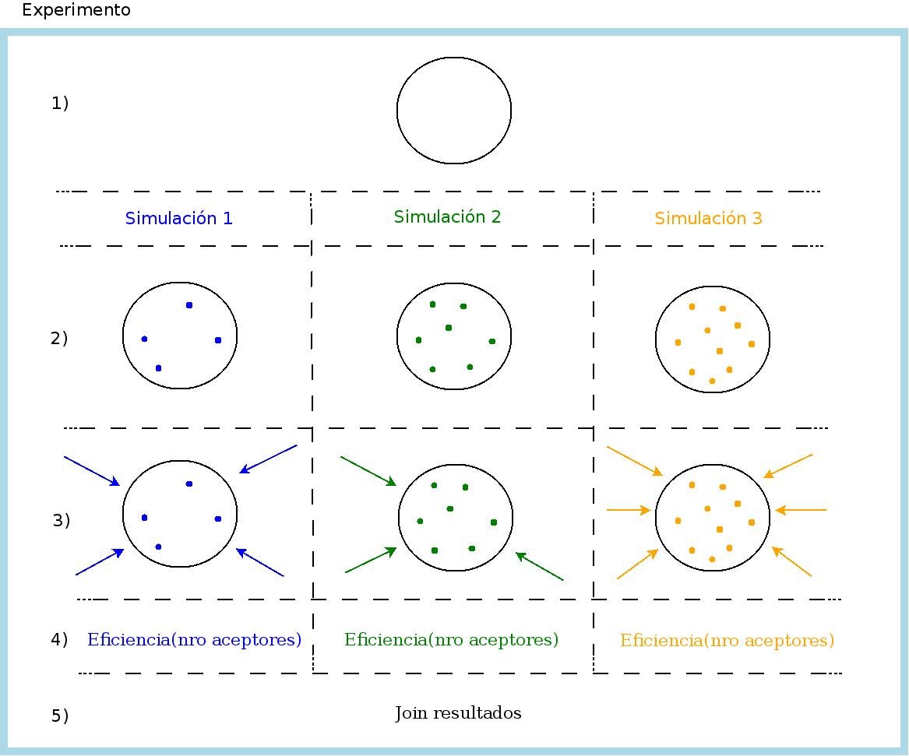

Overview
========
Comprobar eficiencia de Quenching.

Mediante simulaciones de Monte Carlo, se quiere estudiar la eficiencia de Quenching para una nanopartícula (NP) determinada. Estas simulaciones van a ser contrastadas con las mediciones experimentales realizadas en el Laboratorio de Microscopia Optica Avanzada (LMOA) de la Universidad Nacional de Río Cuarto (UNRC).

En principio, son tres los experimentos en los que queremos corroborar la eficiencia de Quenching:
1. En el caso de tener los aceptores distribuidos volumetricamente en la NP.
2. Que los aceptores estén sobre la superficie de la NP.
3. En los dos casos anteriores el fotón es generado mediante un laser. Se quiere estudiar que sucede en el caso de que sea generado mediante una electrólisis química.

Para el experimento 1, estamos trabajando basados un en paper, desarrollando nuestra herramienta computacional. Para los experimentos 2 y 3, se quiere verificar una hipótesis de trabajo, no existiendo trabajos de referencia.

¿Que queremos Simular?
----------------------

En la Fig. 1 se muestran los procesos que intervienen en el experimento, con el objeto de detallar los procesos secuenciales y paralelos (multicore/GPU/cluster/cloud).
Existen tres niveles de paralelismo:

1) Bombardeo de fotones, el punto 3) de la fig.
   
   * Paralelizar en multicore/GPU/cluster.
   
2) Cada una de las simulaciones (identificada por cada columna en la fig).
	 
   * Paralelizar en cluster/cloud.

3) Cada experimento (identificado por la fig. completa).

   * Paralelizar en la infraestructura cloud.

1) Los parámetros que definen un determinado experimento están dados en el archivo de configuración experimento.conf.
	      
   * Definir la NP. Es la misma NP en todo el experimento (experimento.conf).

   * Definir cantidad de simulaciones para la NP dada. En el ej. de la fig, son tres simulaciones (las columnas).

2) Dopar la NP: generar aceptores, distribuirlos homogeneamente, etc. (serial).

   * La cantidad de dopamientos es distinta de cada simulación (es definida en el archivo de configuración).

   * Simulación 1: 4 dopamientos

   * Simulación 2: 7 dopamientos

   * Simulación 3: 10 dopamientos

3) Bombardear la NP: la cantidad de bombardeos es distinta en cada simulación (es definida en el archivo de configuración).  

   * Simulación 1: 4 bombardeos  

   * Simulación 2: 3 bombardeos  

   * Simulación 3: 6 bombardeos  

   * El bombardeo se debe hacer en paralelo (multicore/GPU/Cluster). Cada bombardeo (indicado por cada flecha en la Fig) tiene un ID único y obtiene un único resultado. Todos los bombardeos de una simulación escriben su resultado en una variable (array) compartida accediendo mediante su ID al subindice correspondiente.

   * Simulación1.Bombardeos[resultado-bombardeo1, resultado-bombardeo2, ...]

   * Simulación2.Bombardeos[resultado-bombardeo1, resultado-bombardeo2, ...]

   * Simulación3.Bombardeos[resultado-bombardeo1, resultado-bombardeo2, ...]

4) Se calcula la eficiencia en función del nro de aceptores (cálculo serial).

   * Eficiencia1 = CalcularEficiencia(Simulación1.Bombardeos)

   * Eficiencia2 = CalcularEficiencia(Simulación2.Bombardeos)

   * Eficiencia3 = CalcularEficiencia(Simulación3.Bombardeos)

5) Join de los resultados de cada una de las simulaciones para su post-procesamiento (gráfico).

   * CalcularEficienciaTotalExperimento(Eficiencia1, Eficiencia2, Eficiencia3)

Se podran ejecutar un nro arbitrario de experimentos distintos, en simultáneo, haciendo uso de la infraestructura cloud.

Proyectos similares
----------------------

No encontramos ningún proyecto similar a este.
